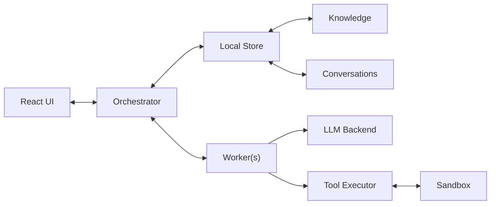

Açaí
====

An agentic AI orchestration platform that manages LLM-powered agents, tool
execution, task queues, projects, knowledge bases and visual workflows — all
through a modern web UI backed by a streaming FastAPI server.

## Architecture overview



### Repository layout

```
acai/
├── orchestrator/       # FastAPI server, chat, agents, projects, config, dispatcher
├── worker/             # Worker HTTP app, LLM abstraction, sandbox backends
├── tasks/              # Task graphs: converse, think, uber, scribe, dynamic workflows
├── tools/              # Agent tools: filesystem, shell, git, code, web, search, …
├── queue/              # SQLAlchemy-backed work queue (WorkQueue)
├── agents/             # Built-in agent definitions (system.j2 templates)
├── models/             # Model backends: vLLM, llama.cpp, SGLang, TensorRT-LLM, …
├── scheduler/          # Multi-provider scheduling
├── cli/                # CLI entry points: orchestrator, worker, mcp
├── ui/                 # React frontend (Vite, Chakra UI v3, React Flow)
│   └── src/
│       ├── components/ # Pages & reusable components
│       ├── services/   # api.ts (REST/SSE), types.ts
│       ├── contexts/   # WebSocketContext (socket.io)
│       └── layout/     # Shell layout with sidebar
└── plugins/            # Optional plugin discovery
workspace/              # Runtime data (default location, configurable)
├── conversations/      # Global conversation histories
├── projects/           # Per-project data, tasks, conversations
├── workflows/          # User-defined workflow graphs
├── knowledge/          # Markdown knowledge documents
├── agents/             # User agent overrides (copy-on-write)
└── work.db             # SQLite task queue database
```

### Orchestrator

The orchestrator is a **FastAPI** application augmented with **python-socketio**
for real-time events. It owns:

- **ChatStore** — filesystem-backed conversation persistence with a three-tier
  layout: global (`workspace/conversations/`), project-scoped
  (`workspace/projects/<project>/conversations/`), and task-scoped
  (`workspace/projects/<project>/<task_id>/`).
- **AgentStore** — agent definitions with Jinja2 system-prompt templates, tool
  lists, sandbox flags. Built-in agents ship in `acai/agents/`; user overrides
  are written to `workspace/agents/` with copy-on-write semantics.
- **WorkQueue** — a SQLAlchemy task queue (SQLite by default) with statuses
  `pending → curating → ready → in_progress → completed/failed/review`,
  dependency tracking, priority ordering, and timeout reaping.
- **ProjectStore** — project metadata (`definition.json`), scaffolding, and
  git-clone support.
- **KnowledgeStore** — slug-based Markdown documents organized as
  `subject / subsubject / title`.
- **ProviderScheduler** — routes LLM calls across configured providers.
- **LoadBalancer** — selects healthy workers for dispatch.

#### API surface

| Group | Examples |
|-------|----------|
| Conversations | CRUD, history, context stats, inflight check |
| Chat | `/converse`, `/think/converse`, `/uber/converse`, `/scribe/converse` |
| Workflows | CRUD, node-type registry, validate, run |
| Tasks | CRUD, tree queries |
| Knowledge | CRUD, search, append |
| Projects | CRUD, scaffold/clone |
| Agents | CRUD, template read/write, reset |
| Providers | CRUD, activate |
| Workers | Register, heartbeat, status |
| Config | Read/patch system config |
| Streaming | SSE stream replay via `/stream/{id}` |

### Workers

Workers are lightweight HTTP servers that register with the orchestrator and
expose two core endpoints:

- **`POST /worker/llm/complete`** — streams tokens back as SSE (`token`,
  `reasoning`, `tool_call_delta`, `done`, `error`).
- **Tool routes** — execute agent tools in-process or forward sandboxed calls
  through the `SandboxProxy`.

LLM backends are pluggable via a `create_llm` factory: **vLLM**, **llama.cpp**,
**SGLang**, **TensorRT-LLM**, or a generic OpenAI-compatible endpoint.

### Sandbox system

When an agent is marked `uses_sandbox`, tool calls flagged `sandbox=True` run
inside an isolated environment. Supported backends:

| Backend | Description |
|---------|-------------|
| `none` | Direct in-process execution (no isolation) |
| `docker` / `podman` | Container-based isolation |
| `bubblewrap` | Linux user-namespace sandbox (bwrap) |
| `nsjail` | Google nsjail with seccomp + cgroups |
| `firecracker` | Firecracker microVM |

Inside the sandbox, `acai mcp` starts a minimal HTTP tool server that the
worker's `SandboxProxy` communicates with.

### Task graphs

Every chat interaction runs through a **TaskGraph** — a directed execution graph
that orchestrates the agent loop:

| Graph kind | Description |
|------------|-------------|
| `converse` | Standard agent loop with tool calling |
| `think` | Emulated chain-of-thought reasoning step before conversation |
| `converse_scribe` | Adds a curator (document selection) and scribe (note-taking) phase |
| `uber` | Routes messages to the best conversation before conversing |
| `workflow` | User-defined visual graph (`DynamicGraph`) with typed exec/data pins |

Visual workflows are built in the React Flow-powered editor and persisted as
JSON node/edge specs.

### Frontend

The UI is a **React 19 + TypeScript** single-page application built with
**Vite** and styled with **Chakra UI v3**. Communication with the orchestrator
uses three channels:

| Channel | Usage |
|---------|-------|
| REST | CRUD operations, one-shot queries |
| SSE | LLM token streaming (via POST-based `SSEStream`) |
| socket.io | Real-time task updates, status, events, telemetry, toasts |

Key pages: **Home**, **Conversations**, **Projects** (Kanban board),
**Workflows** (visual graph editor), **Knowledge**, **Agents**, **Tasks**,
**Settings**, **Status**.
