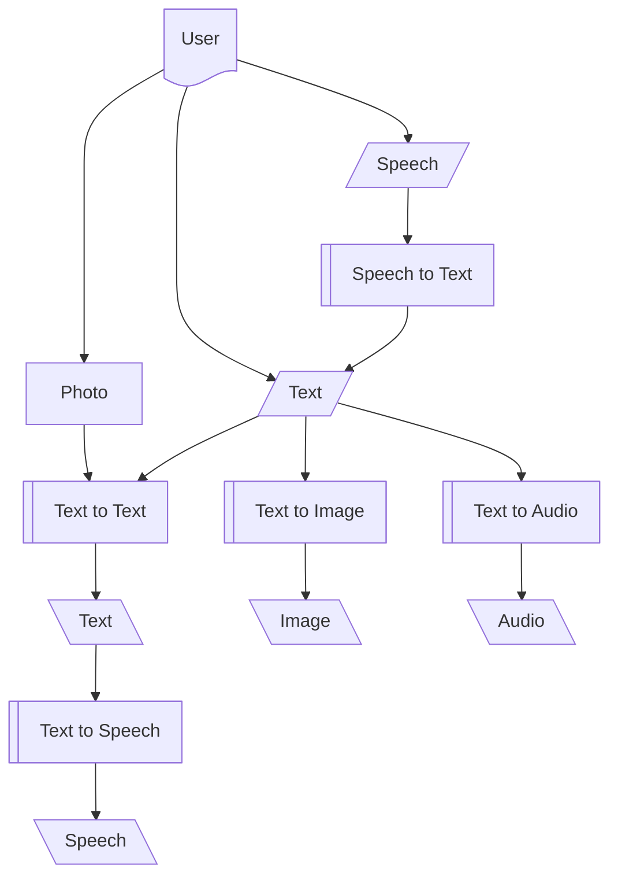

assai
=====

* Test for AI model in inference 

   * Depth Estimation
   * Key point detection
   * Object Detection
   * Image Segmentation
   * Text to image
   * (Text + Image) to Video
   * Text to 3D
   * Image to 3D
   * Video to Video
   * Translation
   * Text Generation
   * Text to speech
   * Text to audio
   * Graph Machine Learning

* Audio
   * AudioClassification
   * AutomaticSpeechRecognition
   * TextToAudio
   * ZeroShotAudioClassification
* Computer Vision
   * Depth Estimation
   * Image Classification
   * Image Segmentation
   * Image to Image
   * KeypointMatching
   * Object Detection
   * VideoClassification
   * ZeroShotImageClassification
   * ZeroShotObjectDetection
* NLP
   * QuestionAnswering
   * Summarization
   * TextClassification
   * TextGeneration
   * Translaation
* MultiModal
   * Image to Text
   